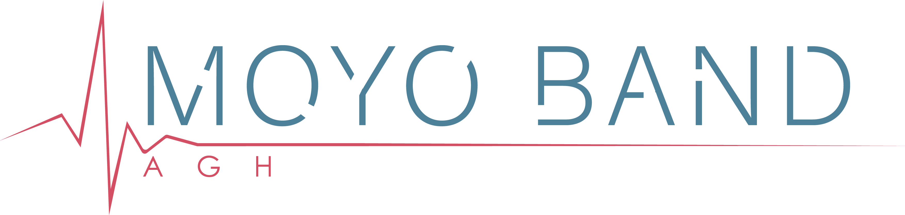
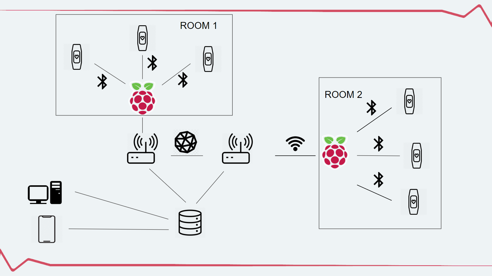
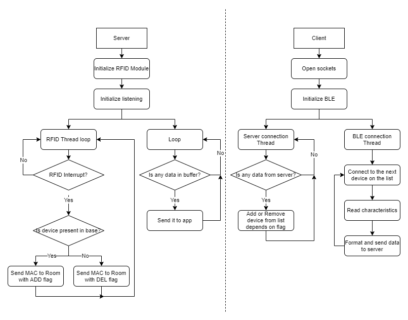
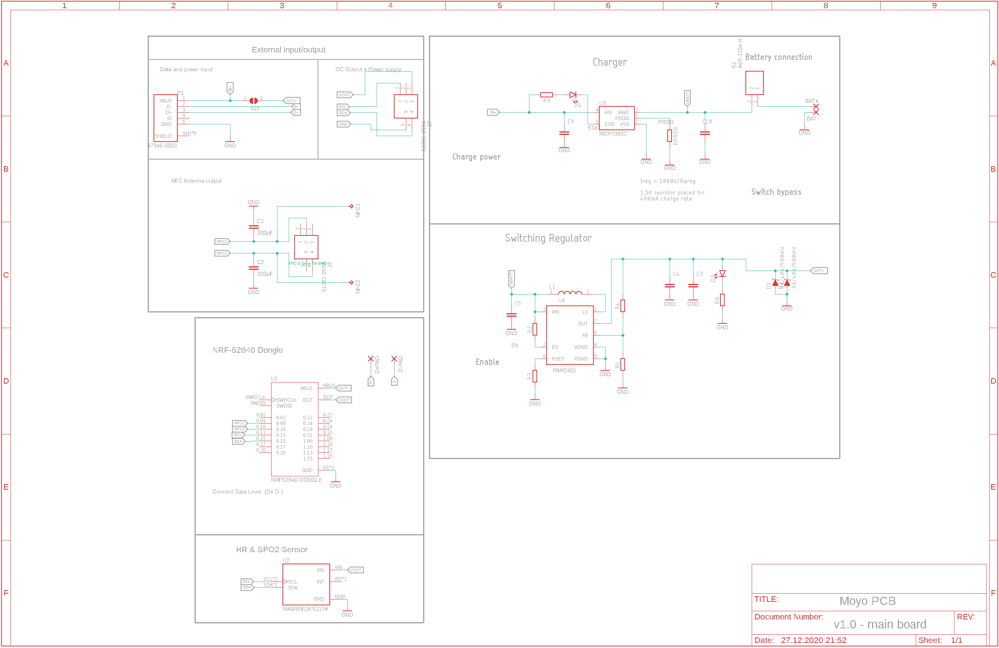
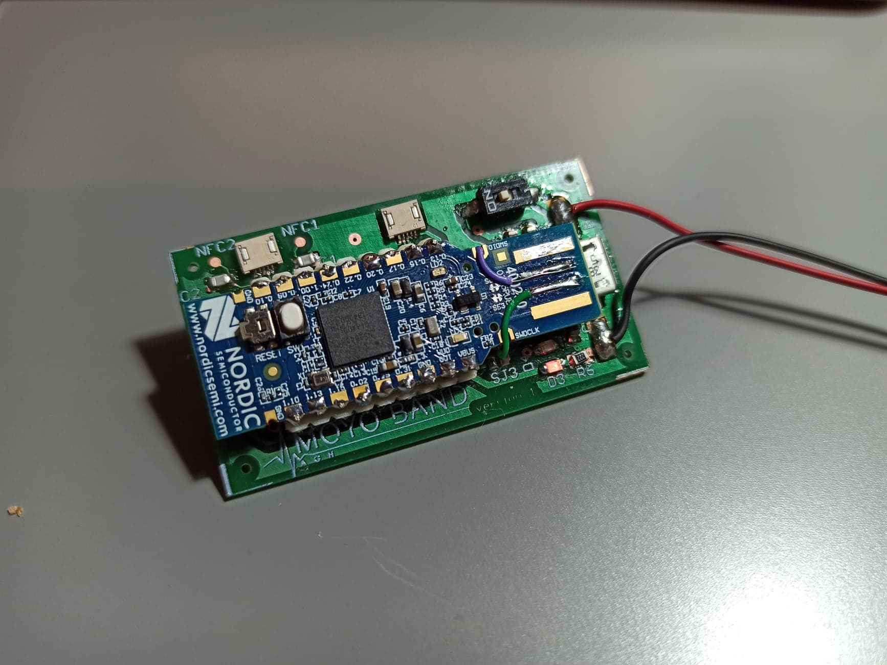
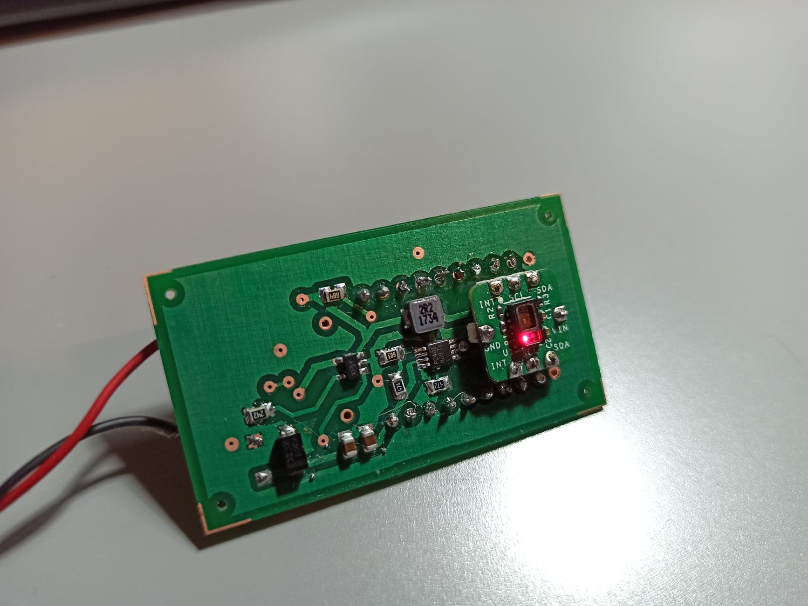

# Moyoband device
This repository is focused on hardware part of Moyoband project.

## Assumptions 
Our biggest goal is make a small band using nRF52840 SoC. We're going to use Bluetooth Low Energy (BLE) connection. A few bands should connect sequentially to one Raspberry Pi Zero and send data to it. We'are going to measure heart rate, saturation and temperature. To identify band, we use MAC address sent with RFID 13,56MHz.  
It's possible to add accelerometer in future, to provide better care of patient.

## Used protocols
- TWI (I2C) - connection with sensor
- BLE - wireless connection with Raspberry
- RFID - adding band to database

## Used elements
- nRF52840 Dongle and Development Kit - To provide easier debug of the code [nRF52840 DK](https://www.nordicsemi.com/Software-and-Tools/Development-Kits/nRF52840-DK)
- MAXREFDES117# I2C, Ultra Low-Energy Heart Rate and Pulse-Oximetry sensor [PRODUCENT SITE](https://www.maximintegrated.com/en/design/reference-design-center/system-board/6300.html)
- Raspberry Pi 4 - Used as server [PRODUCENT SITE](https://www.raspberrypi.org/products/raspberry-pi-4-model-b/)
- Raspberry Pi Zero W - Used as access points, bridges between BLE and Wi-Fi connection [PRODUCENT SITE](https://www.raspberrypi.org/products/raspberry-pi-zero-w/)
- PN532 RFID module - Used to read NFC data from devices and easy add them to rooms [PN532](https://botland.com.pl/moduly-i-tagi-rfid/8240-modul-rfidnfc-pn532-1356mhz-i2cspi-karta-i-brelok.html)
- Custom PCB designed by Mateusz Kozyra [Git](https://gitlab.com/MatKozyra52)

## Concept
### How should it looks like?
  

### Network schematics

### Hardware schematics

 

## Possibilities to continue work
This project is very flexible if you want to develop it. My thoughts:
1. Microcontroller
    - We should consider if we really need nRF52840 with all it's power. The core of this processor is Cortex-M4 but with all Nordic features it can be overkill.
    - Nordic's products are difficult to learn. I achieved 6mA average current consumption. In Idle_state it was about 5mA with 15mA peaks for measurment and send every 10 seconds. I think it's definitely too much. If we want to work with 100mAh battery about 170h   we need to acheive about 600uA average current.
    - Additionally cost of Nordic components is really high
    - As an alternative we can use ATmega328p or STM32 maybe
2. Connectivity
    - BLE can be really Low Power but it's difficult to configure it well. The next problem is 2.4GHz working frequency. In the same band we can find smartphones, smartwatches etc. so when we have ~70 patients on one floor we can have problems with lost connections.
    - I'm thinking about 868MHz Radio Transmission. It's much cheaper, band is not so full and it offers much better range. About current consumption it takes little more in peak but it's much shorter so probably we can optimize it.
3. Sensor
    - Algorithm is definitely not so precisious. We should provide much better error correction.
    - In future we can try to use better voltage converters to cut some current.

## Connected repos
To use this system you should downlad and configure [Moyoband Network](https://gitlab.com/moyoband-group/moyoband_network/-/tree/radoslaw_srv)
## Video
[Youtube presentation in polish](https://youtu.be/xFIGcQSHniY)
## To-Do list
- [x] Provide git repo (completed if repo is accepted by leader)
    - [x] Make concept graph
    - [x] Make repo
    - [x] Share link with course leader
- [x] Sensor handling
    - [x] Run sensor with Nordic board
    - [x] Get first data from sensor
    - [x] Calculate correct data
- [x] BLE connection
    - [x] Read about BLE stack
    - [x] Configure Development Kit for our use case
    - [x] Wake up device with internal timer
    - [x] Provide connection with NRF Connect destkop app
    - [x] Write python app to receive data from one device
    - [x] Develop app to read data sequentially
        - We're not limited in bands now
    - [x] Add comments to BLE library
- [x] RFID
    - [x] Read about getting MAC in Nordic Software Development Kit (SDK)
    - [x] Get MAC while running device
    - [x] Turn on RFID permanently
    - [x] Read data with phone
    - [x] Write python app on Raspberry to get MAC
        - It's in moyoband_network project
    - [x] Is it possible to interrupt device with RFID?
        - [x] If yes, do it
            - It's built into nRF so I did. But in library for pn532 there's bug somewhere which I can't find...
        - [x] If not, look for low energy solution
            - I consider if BLE is good way. Maybe it's better to use simple Radio transmitter without connection?
- [x] Connection with database
    - [x] Write client app
        - [x] Get list of bands from server
        - [x] Connect to bands sequentially
        - [x] Send data to server
        - [x] Provide run without ran server
            - I decided to don't do it because of security. Data could may have been stolen with any server
    - [x] Write server app
        - [x] Send bands to specified clients
        - [x] Receive and sort data from one client
        - [x] Upgrade it to work with many clients (select function!)
            - It's moyoband_network project. Actually i limited it to 5 Raspberries
        - [x] Make endpoints for app team

